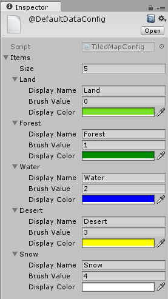
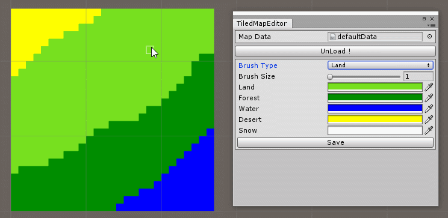

## 格子地图数据编辑器

用于编辑地图格子数据，可使用笔刷来修改格子数据。目前仅支持方格形式的地图单元，未来可能会支持斜45度和六边形格子。

（如果想用来绘制像素风格的图片当然也可以。）

## 使用方法

1. 准备工作

为你的数据创建Adapter类，继承`BaseDataAdapter`，并实现其中的抽象属性和抽象方法，可参考`DefaultDataAdapter`或基于其修改。这一步由程序同学完成。

2. 开始编辑地图数据

通过菜单栏（AillieoUtils/TiledMapEditor）打开编辑器窗口，然后选择对应的Adapter。如果是基于现有数据修改则需要将对应数据拖到data。

3. 首次使用时，需要修改配置文件，定义不同地块的名称、枚举值和颜色。

4. 选择笔刷的尺寸和地块格子类型，开始编辑。

5. 完成编辑后点击保存。

## 运行环境

在Unity 5.6.4f1中进行过测试，可以正常使用。较新版本的Unity应该都可以兼容。

---

## Editor for tiled map data

It can be used to edit data of a tiled map, and value of tiles can be modified with a brush. Currently only orthogonal maps are supported and maybe isometric and hexagonal maps will be supported in the future.

(Of course it can be used to make pixel art images.)

## Instructions

1. Preparation

Create an Adapter for your data witch should inherit `BaseDataAdapter` and the abstract properties and abstract methods should be implemented. Take `DefaultDataAdapter` as reference or simply modify it to make it yours. These works should be supported by programmers.

2. Start editing

By click menu item (AillieoUtils/TiledMapEditor) you open the editor window, and then select the certain Adapter for your data. If you are modifying some existing data you shall drag it to the data field.

3. When editing for the first time you better complete the config file in advance, that means the names, enum values and colors of different tiles should be defined.

4. Select the size and tile type for your brush and enjoy your painting.

5. Click Save when editing is done.

## Requirement

The editor was tested in 5.6.4f1 and it works well. Any newer versions of Unity are supposed to be compatible with but not guaranteed.
